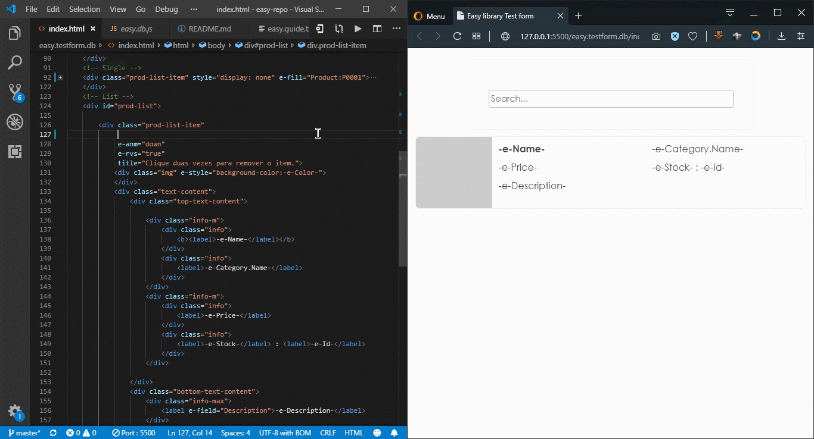
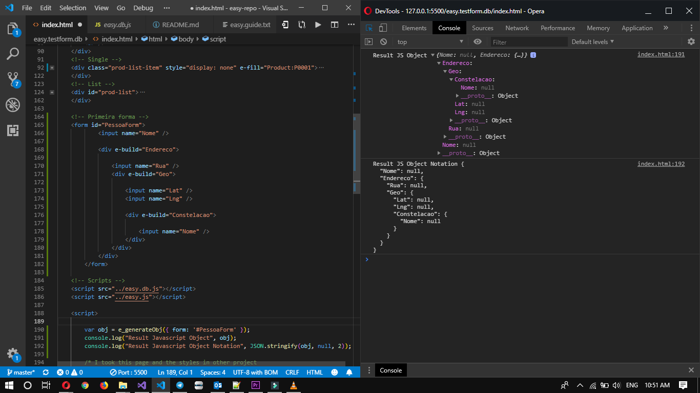

<p align="center" style="height:120px">
    
<p>

<h2 align="center"> easy.js </h2>

<p style="text-align: justify">
    Easy js is a javascript library to assist in the creation of web💻 or mobile📲 applications (using phonegap, in this case). It extends from <b><i>Easy and Asynchronous Javascript</i></b>. It enables and facilitates the disposition of information from a server or a data source.
</p>

<p style="text-align: justify">
    <b>Why use? 🤔</b><br/>
    Because as the name says easy js, it is very easy to use, and allows you to separate HTML from Javascript as much as possible, with easy you can create structured objects to be sent to the server or even manage a simple list of javascript objects. With simple commands (HTML Properties or as called Easy Properties) you are able to list data, populate fields, post data to an API, and more. You only need to know HTML📃, Javascript📜, and / or CSS🎫.
     You will find more detailed documentation in the doc folder. 
</p>
<p>
    <h2>☝ Very important note:</h2>
    Use the easy functions after the HTML DOM is fully loaded. Eg.: <b>window.onload = () => {}, document.addEventListener ('DOMContentLoaded', () => {}), $ (document) .ready (() => {}), etc.</b>
</p>
<hr />

<p style="text-align: justify">
    In order to use it with ajax requests, it must be combined or imported with the <b>easy.ajax.js file.</b>
</p>

<p style="text-align: justify">
    The first step is to reset <b><i>e_url</b></i> in the file, by default it comes:
</p>

```javascript
    // Default value
    let e_url = 'https://jsonplaceholder.typicode.com/'
```

Example 👇

```javascript
    // Example
    // Remember to always use the last backslash
    e_url = 'http://127.0.0.1/api/'
```

<h4 align="center"> Dealing with HTML 📃</h4>

Some default commands to control HTML elements:

    e-tmp, e-m-tmp, e-id, e-filter, e-anm, -e-, e-fill, e-build, e-rvs, e-array.

Listing data from an API
We will use the commands: **e-tmp, e-anm, e-rvs** 
```HTML
    <!-- e-tmp="Pessoa" -> To list all route data api/Person
         e-anm="up" -> To animate data entry
         e-rvs="true" -> To reverse data entry
         -e- -> To determine where the value of a field will be placed -->
    <div id="container">
        <div e-tmp="Pessoa" e-anm="up" e-rvs="true">
            <label>
                -e-Nome-
            </label>
            <label>
                -e-Idade-
            </label>
        </div>
    </div>
```
    Gif Illustration


Generating a Javascript Object from an HTML Element using **e_generateObj(object)** easy function

```HTML
    <!-- One way -->
    <form id="PessoaForm">
        <input name="Nome" />
        <div e-build="Endereco">
            <input name="Rua" />
            <div e-build="Geo">
                <input name="Lat" />
                <input name="Lng" />
                <div e-build="Continente">
                    <input name="Nome" />
                </div>
            </div>
        </div>
    </form>

    <!-- Another way -->
    <form id="PessoaForm">
        <input name="Nome" />
        <div e-build="Endereco">
            <input name="Rua" />
            <div e-build="Endereco.Geo">
                <input name="Lat" />
                <input name="Lng" />
                <div e-build="Endereco.Geo.Continente">
                    <input name="Nome" />
                </div>
            </div>
        </div>
    </form>
```
The object will be constructed based on the hierarchy created in the HTML Element with the properties that easy.js offers.
```javascript
    var obj = e_generateObj({ form: '#PessoaForm' });
    console.log(obj);
```

    Image Illustration


<h4 align="center"> Main functions </h4>

```javascript

    // CRUD - Create, Read, Update and Delete, Extra GetOne
    
    // ('controller', 'object/selector', 'generateId')
    easy.create(string, object/string, boolean);
    
    // ('controller', 'funcao', 'filtering function', 'search param')
    easy.read(string, callback, string, string);

    // ('controller', 'object/selector', 'id', 'campo do id')
    easy.update(string, object/string, string, string);

    // ('controller', 'id', 'id field')
    easy.delete(string, string, string);

    // ('controller', 'id', 'HTML Element to be filled', 'id field')
    easy.getOne(string, string, string, string);

    // Create
    //#1 Example
    easy.create('Pessoa', '#PessoaForm');
    
    //#2 Example
    easy.create('Pessoa', { 
        Id:'P0001', 
        Nome:'Afonso Matumona', 
        Idade: 23 
    });
    
    
    // Read
    easy.read('Pessoa', function(data){
        console.log(data);
    });

    
    // Update
    //#1 Example
    easy.update('Pessoa', '#PessoaForm', 'P0001');
    
    //#2 Example
    easy.update('Pessoa', { 
        Nome:'Matumona Elias', 
        Idade: 16 
    }, 'P0001');


    // Delete
    easy.delete('Pessoa', 'P0001');

    
    // GetOne
    easy.getOne('Pessoa', 'P0001');

```

For javascript lists the control is as simple as api, the difference is that the data source must be specified with **source(ds)** function.

<p>Given a javascript list of songs, we can perform the basic operations of <i>easy</i> 😃...</p>

```javascript
    (async () =>{

        // Example
        var playlist = [];
        
        // Create
        await easy.source(playlist).create({
            titulo:'Final Episode',
            artista:'Asking Alexandria',
            album:'Stand Up And Scream'
        });
        
        //Read
        let a = await easy.source(playlist).read();
        console.log(a);
        
        // Update
        await easy.source(playlist).update({
            titulo:'Asking Alexandria - Final Episode',
            artista:'Asking Alexandria',
            album:'Stand Up And Scream'
        }, 0);
        
        // Delete
        await easy.source(playlist).delete(0);
        
    })();
```
<p>How to quickly list it in HTML? 🤔, answer! 👇 👌, As is done in the small example given above of <b><i>e-tmp</i></b>, the small difference is that it must be passed from which list data come from in square brackets, [...].</i></p>


```HTML
    <div id="container">
        <div e-tmp="[playlist]"
             title="-e-album-">
            <label>
                -e-titulo-
            </label>
            <label>
                -e-artista-
            </label>
        </div>
    </div>
```

To be able to find and fire events for all elements that exist in the DOM, even those that were added after the DOM was loaded, easy provides: **e(...)**, with the parameters:
    
    e('selector', 'event', callback(element event, element))

```javascript
    // Example
    e('#btn1' ,'click', function(e, el){
        console.log('Hi', e);
    });
```

<p align="center" style="font-size:11pt; margin:0;"> 
    Thanks a lot for visiting easy.js repo 🙂, I hope you enjoyed!! 👌<br/>
    <h4 align="center">Salute 😃</h4> 
</p>
<br/>

<p align="center" style="height:90px">
    
</p>

<p align="center" style="font-size:11pt; margin:0;"> 
    © 2019, Afonso Matumona Elias | <b>Translated by Google Translator</b>
</p>