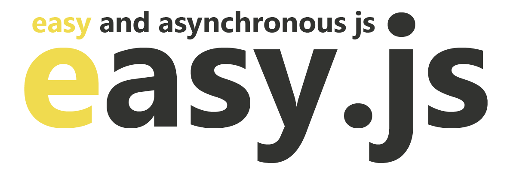

<p align="center" style="height:120px">
    
<p>

<h2 align="center"> easy.js </h2>

<p style="text-align: justify">
    Easy js é uma javascript library para auxiliar na criação de aplicações web💻 ou mobile📲 (usando phonegap, no caso). Ela estende-se de <b><i>Easy and Asynchronous Javascript</i></b> que em português podemos traduzí-lo como <b><i>Javascript fácil e assíncrono</i></b>. Ela possibilita e facilita na disposição das informações vindas de um servidor ou uma fonte de dados.
</p>

<p style="text-align: justify">
    <b>Porquê usar? 🤔</b><br/>
    Porque tal como o nome diz easy js, ela é mesmo muito fácil de usar, e permite separar o máximo possível o HTML do Javascript, com o easy tens a possibilidade de criar objectos estruturados para serem enviados ao servidor ou mesmo gerir uma simples lista de objectos javascript. Com simples comandos (Propriedades HTML ou como denominados Easy Properties) você é capaz de listar dados, preencher campos, postar dados a uma API e muito mais. Só precisas conhecer HTML📃, Javascript📜, e/ou CSS🎫.
    Poderás encontrar a documentação mais detalhada na pasta doc. 
</p>

___

<p style="text-align: justify">
    Para poder usar ele com requisições ajax, deve ser combinado ou importado com o ficheiro <b>easy.ajax.js</b>
</p>

<p style="text-align: justify">
    O primeiro passo é redefinir o <b><i>e_url</i></b> no mesmo ficheiro, por padrão ele vem:
</p>

```javascript
    // Padrão
    let e_url = 'https://jsonplaceholder.typicode.com/'
```

Exemplo 👇

```javascript
    // Exemplo
    // Lembre de usar sempre a última contra-barra
    e_url = 'http://127.0.0.1/api/'
```

<h4 align="center"> Lidando com o HTML 📃</h4>

Alguns comandos predefinidos para poder controlar os elementos do HTML:

    e-tmp, e-m-tmp, e-id, e-filter, e-anm, -e-, e-fill, e-build, e-rvs, e-array.

Listando dados de um api
Vai se usar os comandos: **e-tmp, e-anm, e-rvs** 
```HTML
    <!-- e-tmp="Pessoa" -> para listar todos os dados da rota api/Pessoa
         e-anm="up" -> para animar a entrada dos dados
         e-rvs="true" -> para reverter a inserção de dados 
         -e- -> para determinar onde vai ser posto o valor de um campo-->
    <div id="container">
        <div e-tmp="Pessoa" e-anm="up" e-rvs="true">
            <label>
                -e-Nome-
            </label>
            <label>
                -e-Idade-
            </label>
        </div>
    </div>
```
    Gif Illustration


Geração de Objectos Javascript através de um elemento HTML, usando a função do easy **e_generateObj(object)**

```HTML
    <!-- Uma forma -->
    <form id="PessoaForm">
        <input name="Nome" />
        <div e-build="Endereco">
            <input name="Rua" />
            <div e-build="Geo">
                <input name="Lat" />
                <input name="Lng" />
                <div e-build="Continente">
                    <input name="Nome" />
                </div>
            </div>
        </div>
    </form>

    <!-- Outra forma -->
    <form id="PessoaForm">
        <input name="Nome" />
        <div e-build="Endereco">
            <input name="Rua" />
            <div e-build="Endereco.Geo">
                <input name="Lat" />
                <input name="Lng" />
                <div e-build="Endereco.Geo.Continente">
                    <input name="Nome" />
                </div>
            </div>
        </div>
    </form>
```
O objecto será construído com base o a hierarquia criada no Elemento HTML com as propriedades que o easy.js oferece.
```javascript
    var obj = e_generateObj({ form: '#PessoaForm' });
    console.log(obj);
```

    Image Illustration


<h4 align="center"> Principais funções </h4>

```javascript

    // CRUD - Create, Read, Update and Delete, Extra GetOne
    
    // ('controlador', 'objeto/selector', 'gerarId')
    easy.create(string, object/string, boolean);
    
    // ('controlador', 'funcao', 'filtrador', 'filtro')
    easy.read(string, callback, string, string);

    // ('controlador', 'objeto/selector', 'id', 'campo do id')
    easy.update(string, object/string, string, string);

    // ('controlador', 'id', 'campo do id')
    easy.delete(string, string, string);

    // ('controlador', 'id', 'elemento HTML a ser preenchido', 'campo do id')
    easy.getOne(string, string, string, string);

    // Create
    //#1 Exemplo
    easy.create('Pessoa', '#PessoaForm');
    
    //#2 Exemplo
    easy.create('Pessoa', { 
        Id:'P0001', 
        Nome:'Afonso Matumona', 
        Idade: 23 
    });
    
    
    // Read
    easy.read('Pessoa', function(data){
        console.log(data);
    });

    
    // Update
    //#1 Exemplo
    easy.update('Pessoa', '#PessoaForm', 'P0001');
    
    //#2 Exemplo
    easy.update('Pessoa', { 
        Nome:'Matumona Elias', 
        Idade: 16 
    }, 'P0001');


    // Delete
    easy.delete('Pessoa', 'P0001');

    
    // GetOne
    easy.getOne('Pessoa', 'P0001');

```

Para as listas em javascript o controlo é tão simples quanto as api, a diferença é que deve ser especificado qual é a fonte de dados com a função **source(ds)**

```javascript

    // Exemplo
    let playlist = [];
    
    // Create
    // Defini true no terceiro parametro para gerar um id automático
    easy.source(playlist).create(null, {
        titulo:'Final Destination',
        artista:'Asking Alexandria',
        album:'Stand Up And Scream'
    }, true);
    
    //Read
    easy.source(playlist).read(null);

    // Update
    easy.source(playlist).update(null, {
        titulo:'Asking Alexandria - Final Destination'
    }, 'KDc12csC8dsdc38vdnt');

    // Delete
    easy.source(playlist).delete(null, 'KDc12csC8dsdc38vdnt');
```

Para poder encontrar e disparar eventos a todos os elementos que exitem no DOM, mesmo aqueles que foram adicionados depois do DOM ser carregado, o easy disponibiliza: **e(...)**, com os parametros: 
    
    e('selector', 'evento', funcao (elemento, evento do elemento))

```javascript
    // Exemplo
    e('#btn1' ,'click', function(e, el){
        console.log('Olá', e);
    });

```

<p align="center" style="font-size:11pt; margin:0;"> 
    Thanks a lot for visiting the easy.js repo 🙂, I hope that you enjoyed!! 👌<br/>
    <h4 align="center">Salute 😃</h4> 
</p>
<br/>

<p align="center" style="height:90px">
    
</p>

<p align="center" style="font-size:11pt; margin:0;"> 
    © 2019, Afonso Matumona Elias 
</p>